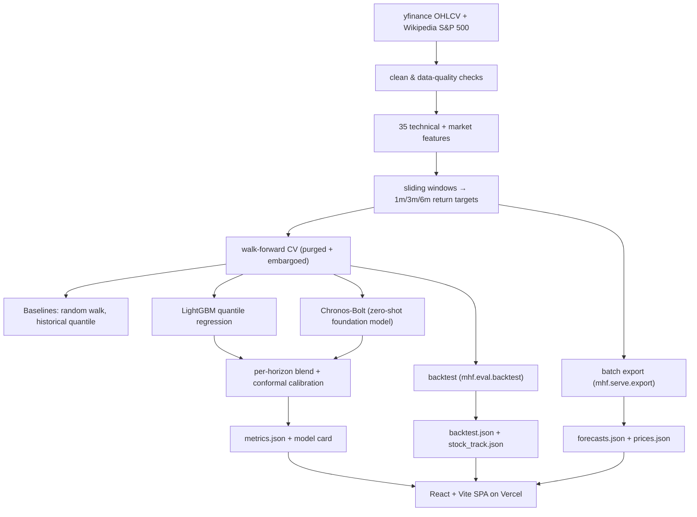

# Multi-Horizon Probabilistic Equity Forecaster

> Predicts a **distribution** of 1-, 3-, and 6-month returns for every S&P 500 stock — not a single guess — and shows, honestly, whether that signal makes money.

[](https://www.python.org/)
[](https://react.dev/)
[](https://vitejs.dev/)
[](#testing)
[](https://mhf-forecaster.vercel.app)

**🔗 Live demo: [mhf-forecaster.vercel.app](https://mhf-forecaster.vercel.app)**

---

## Recruiter TL;DR

- **What it is:** an end-to-end quant-ML system that forecasts *probabilistic* return distributions for ~497 S&P 500 stocks at three horizons, blends a gradient-boosted model with a zero-shot time-series foundation model, calibrates its own uncertainty, and ships to a deployed interactive web app.
- **Hardest problem solved:** diagnosing *why* fine-tuning the Chronos foundation model silently broke it (it forecast every stock down 35–54% at 6 months), root-causing it to level-space training compounding through an autoregressive rollout, and fixing it with evidence — then proving the whole pipeline is leak-free with purged/embargoed walk-forward validation.
- **Impact (out-of-sample, honestly measured):** the ensemble is calibrated to ~0.80 band coverage across horizons; a monthly long-short decile strategy on the signal earns a **0.70 Sharpe (0.59 net of 10 bps/side)** over a 15-year backtest (2009–2026).

---

## Overview — the problem & why it's built this way

Most "stock predictor" projects output a single number, leak future data into training, and report a fantasy accuracy. This project is the opposite on all three counts, on purpose:

1. **Distributions, not point estimates.** Equity returns are mostly noise; a responsible forecast says "≈ +3% over 3 months, 10–90% range −8% to +15%," and is honest that the band *is* the answer. The models predict quantiles (10th / 50th / 90th percentile) and the app foregrounds the uncertainty.
2. **Leak-free by construction.** Everything is scored with **purged, embargoed walk-forward cross-validation**. The ensemble blend weight and the calibration correction are fit *only* on a validation fold, never on the test rows they're reported against.
3. **Honest about the edge.** Daily equity signal is tiny (information coefficient ≈ 0.03–0.06). Rather than hide that, the app includes an **economic backtest** that shows the small per-stock edge only becomes tradeable when diversified across the whole universe — and a per-stock track record that openly shows the model is near-coin-flip on any *single* name.

It's a portfolio piece meant to demonstrate end-to-end ML engineering *and* the methodological maturity a quant/ML reviewer actually looks for.

## Features

- **Five models, one honest scoreboard** — random-walk and historical-quantile baselines, a LightGBM per-horizon/per-quantile regressor, a zero-shot **Chronos-Bolt** foundation model, and an ensemble that blends them.
- **Per-horizon ensemble + conformal calibration** — the blend weight is fit per horizon; conformalized quantile regression then corrects the bands to hit ~80% coverage (fixed 6-month coverage from 0.67 → 0.80).
- **Walk-forward evaluation** — purged/embargoed CV with a validation fold reserved for weight/calibration fitting, so no reported metric sees its own answer.
- **Economic backtest** — monthly-rebalanced long-short / long-only decile portfolios with Sharpe, CAGR, max drawdown, turnover, and transaction-cost sensitivity.
- **Deployed interactive app** — forecast fan charts, a sortable screener, the backtest with live holdings, a per-stock model track record, and a plain-English methodology page.
- **Batch export, not live inference** — a static-data design: the models run offline and emit JSON the frontend reads directly, so the site is instant, free to host, and demo-proof.

## Architecture

The system is a **batch pipeline that emits static JSON**, consumed by a **serverless static frontend** — there is no model server. This is deliberate: the forecasts only change once a day, so live inference would add cost, latency, and fragility for zero freshness benefit. Heavy PyTorch/GPU work stays offline; the deployed surface is just files.



**Why the pieces are shaped this way**
- **GBM + Chronos, not one model.** The GBM learns from 35 engineered cross-sectional features; Chronos reads the raw price series. They fail differently, so an ensemble diversifies. The blend is fit per horizon because each model is stronger at different horizons.
- **Zero-shot Chronos, on purpose.** Fine-tuning it on price *levels* collapsed its long-horizon forecasts (a documented root-cause in the code). The out-of-the-box model is well-calibrated, so the ensemble uses it as-is — a decision made on measured evidence, not preference.
- **Conformal calibration as a separate stage.** The learned models are slightly overconfident; a distribution-free correction fit on held-out data restores honest coverage without retraining.

## Tech Stack

**Modeling / data (Python ≥ 3.11)** — pandas, NumPy, PyArrow; **LightGBM** (quantile gradient boosting); **AutoGluon-TimeSeries** wrapping **Chronos-Bolt**; SciPy / scikit-learn; `arch` (GARCH volatility); **pydantic-settings** for typed config; yfinance + requests + tenacity (resilient ingestion). Heavy GPU/training deps are an optional `[train]` extra so the core installs light.

**Frontend** — **React 18** + **Vite 5**, React Router, **Recharts** for standard charts, hand-rolled SVG for the signature probability-fan and scatter visuals, self-hosted fonts (Sora / Inter / JetBrains Mono). No backend — it fetches static JSON.

**Tooling / infra** — **ruff** (lint, clean), **pytest** (55 tests), **Vercel** with GitHub push-to-deploy.

## Skills Demonstrated

- **Data engineering / ETL pipeline design** — raw OHLCV → cleaned → 35-feature matrix → windowed model-ready panel, each stage isolated and tested.
- **Applied ML & probabilistic forecasting** — quantile regression, foundation-model integration, ensembling, conformal calibration, leak-free time-series cross-validation.
- **Production ML deployment / MLOps** — a batch inference/export step (`mhf.serve.export`) fully separate from training, emitting a versioned data contract the frontend consumes.
- **System design & architecture** — explicit, documented trade-offs (static export vs. live inference; zero-shot vs. fine-tune; per-horizon blending) throughout the code and this doc.
- **Test-driven development** — 55 automated tests covering data contracts, models, evaluation, backtest math, and the export layer.
- **Cloud deployment (Vercel) + CD** — every push to `main` auto-builds and deploys the live site.
- **Frontend engineering** — a responsive, accessible, dark-themed React SPA with custom data visualizations.

## Results

All figures are **out-of-sample**, from purged/embargoed walk-forward CV and a 15-year backtest — regenerable from the repo (`data/artifacts/metrics.json`, `web/public/data/backtest.json`).

**Ensemble forecast quality (out-of-sample):**

| Horizon | Information Coefficient | Band coverage (target 0.80) |
|--------:|:-----------------------:|:---------------------------:|
| 1 month | 0.010 | 0.78 |
| 3 month | 0.028 | 0.77 |
| 6 month | 0.033 | **0.80** (0.67 before conformal) |

**Economic backtest — monthly decile strategy, 2009–2026 (177 months):**

| Strategy | Sharpe | CAGR | Max drawdown |
|:---------|:------:|:----:|:------------:|
| Long-short (market-neutral) | **0.70** (0.59 net of 10 bps/side) | 9.3% | −30% |
| Long-only top decile | 1.27 | 27% | −21% |
| Equal-weight benchmark | 1.16 | 19% | −22% |

Read honestly: the long-short number is the real *alpha* (market-neutral, survives costs to 30 bps); the long-only figure is largely market beta. The per-stock hit rate is near coin-flip by design — the edge is a portfolio effect, not a single-stock oracle. Known caveat: the backtest universe is *today's* S&P 500, so it carries survivorship bias.

## Getting Started

**Prerequisites:** Python ≥ 3.11, Node ≥ 18. GPU optional (only for the Chronos step).

```bash
git clone https://github.com/shiva-shivanibokka/Multi-Horizon-Stock-Forecasting-AI-Model.git
cd Multi-Horizon-Stock-Forecasting-AI-Model

# --- Python side ---
python -m venv .venv && . .venv/Scripts/activate   # Windows; use .venv/bin/activate on macOS/Linux
pip install -e ".[dev,train]"                        # omit ",train" to skip heavy GPU deps
pytest -q                                            # 55 tests

# --- Frontend ---
cd web
npm install
npm run dev            # http://localhost:5173  (reads the JSON already in web/public/data)
```

The repo ships with generated `web/public/data/*.json`, so the frontend runs immediately without re-running any models.

## Usage

```bash
# Train + evaluate (walk-forward CV, ensemble, conformal) → data/artifacts/
python -m mhf.train                 # add --smoke for a fast 3-ticker sanity run
python -m mhf.train --no-chronos    # GBM + baselines only (no GPU)

# Export the site's forecast data (latest anchor, all tickers) → web/public/data/
python -m mhf.serve.export
python -m mhf.serve.export --no-chronos   # fast GBM-only export for frontend iteration

# Run the economic backtest → web/public/data/backtest.json + stock_track.json
python -m mhf.eval.backtest
```

Programmatic example (the ensemble blend, from `mhf.models.ensemble`):

```python
from mhf.models.ensemble import fit_blend_weight, blend, fit_conformal, apply_conformal

w = fit_blend_weight(chronos_q[val], gbm_q[val], y[val])      # per-horizon weight, validation fold only
delta = fit_conformal(blend(chronos_q[val], gbm_q[val], w), y[val])   # calibration correction
final = apply_conformal(blend(chronos_q[test], gbm_q[test], w), delta)  # applied to held-out test
```

## Project Structure

```
src/mhf/
├── config.py            # typed settings (horizons, windows) via pydantic-settings
├── data/                # ETL: ingest → quality → features → windows → panel
├── models/              # baselines, gbm (LightGBM), chronos_ft (Chronos-Bolt), ensemble
├── eval/                # cv (walk-forward), metrics (pinball/coverage/IC), backtest
├── train.py             # walk-forward training entrypoint → metrics + model card
└── serve/export.py      # batch export of frontend JSON (no live server)
web/                     # React + Vite single-page app (static, reads public/data/*.json)
tests/                   # 55 pytest tests mirroring the src/ layout
```

## Testing

```bash
pytest -q          # 55 tests
ruff check src tests   # lint (clean)
```

Tests cover data contracts (feature/window/panel shapes), each model's quantile output and crossing-repair, evaluation metrics, ensemble blend + conformal coverage, backtest portfolio math (edge shows up on a good signal, ≈0 on noise), and the export layer. There is no external CI service configured yet — tests are run locally and before deploy.

## Deployment

Deployed as a **static build on Vercel**. The app is client-side-only (hash routing), so the whole site is CDN-served files. A root `vercel.json` points the build at the `web/` sub-directory; every push to `main` triggers an automatic production deploy via the GitHub integration.

- Live: **[mhf-forecaster.vercel.app](https://mhf-forecaster.vercel.app)**
- Refreshing the data = re-run `mhf.serve.export` + `mhf.eval.backtest`, commit `web/public/data/`, push.

## Roadmap / Known Limitations

- **Survivorship bias** in the backtest (current S&P 500 constituents only) — a point-in-time constituent history would make it rigorous.
- **Chronos contributes modestly** — a *correct* fine-tune (on returns, horizon ≤ 64, early-stopping) or using it as a feature-extractor for the GBM is an open experiment.
- **Backtest uses the GBM signal** for speed; a full ensemble-signal backtest needs the Chronos re-run.
- **Static forecasts** as of the last export anchor — not a live, auto-refreshing feed.
- **No external CI** yet; tests run locally.

## License

Not yet licensed (all rights reserved). Add a `LICENSE` (e.g. MIT) before open-sourcing.

---

<sub>Research project — not investment advice. Forecasts are historical/experimental and not a live track record.</sub>
